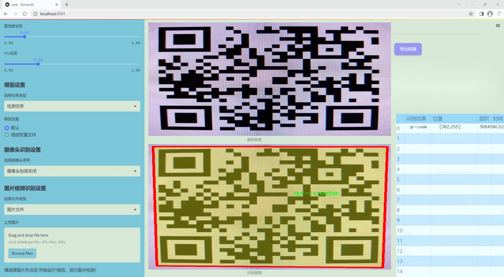
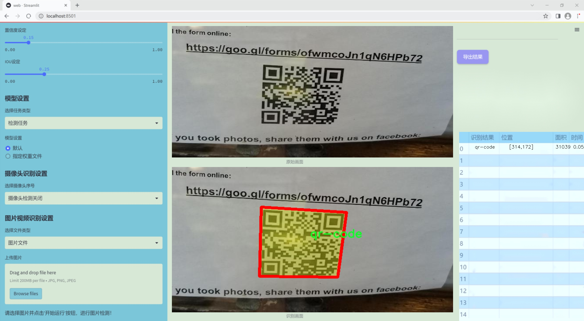
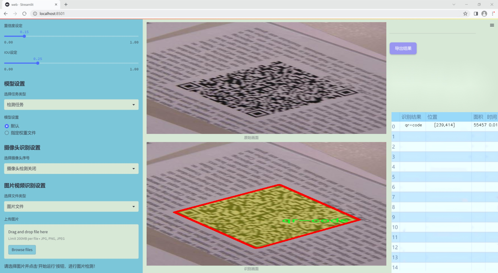
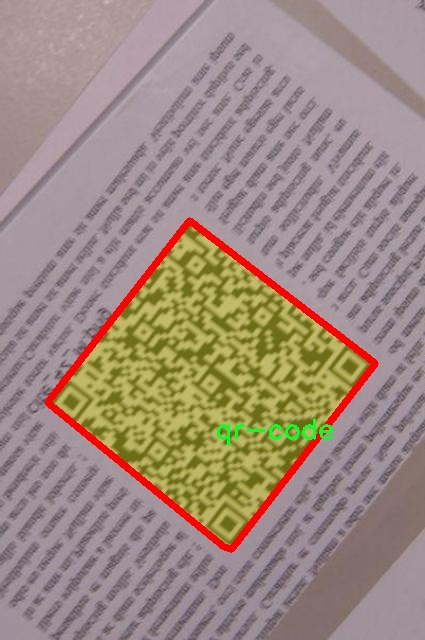
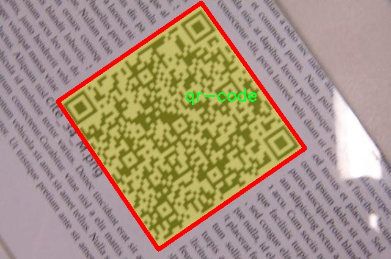
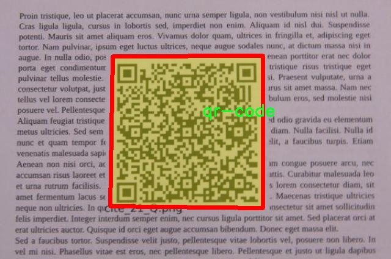
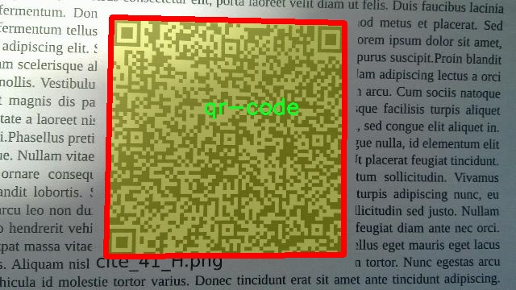
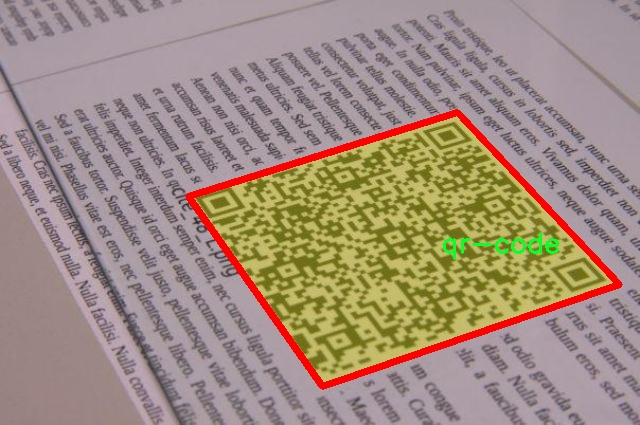

### 1.背景意义

研究背景与意义

随着信息技术的迅猛发展，二维码作为一种高效的信息传递方式，已经广泛应用于商业、物流、支付等多个领域。二维码的快速识别和处理能力，使其在现代社会中扮演着越来越重要的角色。然而，二维码的检测和解码仍然面临着诸多挑战，尤其是在复杂背景、低光照和不同角度等环境下，传统的二维码识别方法往往难以保证高准确率。因此，开发一种高效、准确的二维码检测系统显得尤为重要。

本研究旨在基于改进的YOLOv11模型，构建一个高性能的二维码检测系统。YOLO（You Only Look Once）系列模型因其快速和准确的特性，在目标检测领域得到了广泛应用。通过对YOLOv11的改进，我们希望能够进一步提升其在二维码检测任务中的表现，尤其是在复杂场景下的鲁棒性。为此，我们使用了一个包含1600张图像的二维码数据集，数据集中仅包含一个类别——二维码。这一数据集的构建，旨在为模型的训练和评估提供高质量的样本，并通过数据增强技术，增加模型的泛化能力。

此外，二维码的广泛应用也意味着其安全性和可靠性的重要性。随着二维码技术的普及，二维码的伪造和篡改问题日益突出。因此，开发一个高效的二维码检测系统，不仅能够提升信息传递的效率，还能在一定程度上增强二维码的安全性。通过本研究，我们希望为二维码的智能识别和安全应用提供新的解决方案，为相关领域的研究和实践提供有力支持。总之，基于改进YOLOv11的二维码检测系统的研究，不仅具有重要的学术价值，也为实际应用提供了切实可行的技术保障。

### 2.视频效果

[2.1 视频效果](https://www.bilibili.com/video/BV1e3kgYeECy/)

### 3.图片效果







##### [项目涉及的源码数据来源链接](https://kdocs.cn/l/cszuIiCKVNis)**

注意：本项目提供训练的数据集和训练教程,由于版本持续更新,暂不提供权重文件（best.pt）,请按照6.训练教程进行训练后实现上图演示的效果。

### 4.数据集信息

##### 4.1 本项目数据集类别数＆类别名

nc: 1
names: ['qr-code']


该项目为【图像分割】数据集，请在【训练教程和Web端加载模型教程（第三步）】这一步的时候按照【图像分割】部分的教程来训练

##### 4.2 本项目数据集信息介绍

本项目数据集信息介绍

本项目旨在通过改进YOLOv11模型，提升二维码检测系统的性能。为此，我们构建了一个专门针对二维码检测的高质量数据集，命名为“QRCodeDetection”。该数据集的设计初衷是为了解决现有二维码检测技术在复杂环境下的局限性，从而实现更高的准确率和更快的检测速度。数据集中包含了多种不同场景下的二维码图像，涵盖了各种光照条件、背景复杂度以及二维码的不同尺寸和角度，以确保模型在实际应用中的鲁棒性。

该数据集目前包含一个类别，即“qr-code”，其数量标注为1。这一类别的设置反映了我们对二维码检测任务的专注，旨在通过深度学习技术对二维码进行精准识别。为了增强数据集的多样性，我们在数据收集过程中，涵盖了多种类型的二维码，包括静态二维码和动态二维码，确保模型能够适应不同的应用场景。此外，数据集中还包含了经过精心标注的图像，确保每个二维码的边界框准确无误，这对于训练YOLOv11模型至关重要。

在数据预处理阶段，我们对图像进行了标准化处理，以适应YOLOv11的输入要求，并采用数据增强技术，进一步丰富数据集的多样性。这些措施不仅提高了模型的泛化能力，还能有效防止过拟合现象的发生。通过本项目的数据集，我们期望能够推动二维码检测技术的发展，为相关领域的应用提供强有力的支持。最终，我们希望通过训练得到的改进YOLOv11模型，能够在实际应用中实现高效、准确的二维码检测，为用户带来更好的体验。











### 5.全套项目环境部署视频教程（零基础手把手教学）

[5.1 所需软件PyCharm和Anaconda安装教程（第一步）](https://www.bilibili.com/video/BV1BoC1YCEKi/?spm_id_from=333.999.0.0&vd_source=bc9aec86d164b67a7004b996143742dc)


[5.2 安装Python虚拟环境创建和依赖库安装视频教程（第二步）](https://www.bilibili.com/video/BV1ZoC1YCEBw?spm_id_from=333.788.videopod.sections&vd_source=bc9aec86d164b67a7004b996143742dc)

### 6.改进YOLOv11训练教程和Web_UI前端加载模型教程（零基础手把手教学）

[6.1 改进YOLOv11训练教程和Web_UI前端加载模型教程（第三步）](https://www.bilibili.com/video/BV1BoC1YCEhR?spm_id_from=333.788.videopod.sections&vd_source=bc9aec86d164b67a7004b996143742dc)


按照上面的训练视频教程链接加载项目提供的数据集，运行train.py即可开始训练



     Epoch   gpu_mem       box       obj       cls    labels  img_size
     1/200     20.8G   0.01576   0.01955  0.007536        22      1280: 100%|██████████| 849/849 [14:42<00:00,  1.04s/it]
               Class     Images     Labels          P          R     mAP@.5 mAP@.5:.95: 100%|██████████| 213/213 [01:14<00:00,  2.87it/s]
                 all       3395      17314      0.994      0.957      0.0957      0.0843

     Epoch   gpu_mem       box       obj       cls    labels  img_size
     2/200     20.8G   0.01578   0.01923  0.007006        22      1280: 100%|██████████| 849/849 [14:44<00:00,  1.04s/it]
               Class     Images     Labels          P          R     mAP@.5 mAP@.5:.95: 100%|██████████| 213/213 [01:12<00:00,  2.95it/s]
                 all       3395      17314      0.996      0.956      0.0957      0.0845

     Epoch   gpu_mem       box       obj       cls    labels  img_size
     3/200     20.8G   0.01561    0.0191  0.006895        27      1280: 100%|██████████| 849/849 [10:56<00:00,  1.29it/s]
               Class     Images     Labels          P          R     mAP@.5 mAP@.5:.95: 100%|███████   | 187/213 [00:52<00:00,  4.04it/s]
                 all       3395      17314      0.996      0.957      0.0957      0.0845


###### [项目数据集下载链接](https://kdocs.cn/l/cszuIiCKVNis)

### 7.原始YOLOv11算法讲解

YOLOv11是一种由Ultralytics公司开发的最新一代目标检测模型，以其增强的特征提取能力和更高的效率在计算机视觉领域引人注目。该模型在架构上进行了关键升级，通过更新主干和颈部结构，显著提高了对复杂视觉场景的理解和处理精度。YOLOv11不仅在目标检测上表现出色，还支持实例分割、图像分类、姿态估计和定向目标检测（OBB）等任务，展示出其多功能性。

与其前身YOLOv8相比，YOLOv11在设计上实现了深度和宽度的改变，同时引入了几个创新机制。其中，C3k2机制是对YOLOv8中的C2f的改进，提升了浅层特征的处理能力；C2PSA机制则进一步优化了特征图的处理流程。解耦头的创新设计，通过增加两个深度卷积（DWConv），提高了模型对细节的感知能力和分类准确性。

在性能上，YOLOv11m模型在COCO数据集上的平均精度（mAP）提高，并减少了22%的参数量，确保了在运算效率上的突破。该模型可以部署在多种平台上，包括边缘设备、云平台以及支持NVIDIA GPU的系统，彰显出卓越的灵活性和适应性。总体而言，YOLOv11通过一系列的创新突破，对目标检测领域产生了深远的影响，并为未来的开发提供了新的研究方向。


****文档**** ： _ _https://docs.ultralytics.com/models/yolo11/__

****代码链接**** ： _ _https://github.com/ultralytics/ultralytics__

******Performance Metrics******


​ ** **关键特性****

****◆**** ** **增强的特征提取能力**** ：YOLO11采用了改进的主干和颈部架构，增强了 ** **特征提取****
能力，能够实现更精确的目标检测和复杂任务的执行。

****◆**** ** **优化的效率和速度****
：YOLO11引入了精细化的架构设计和优化的训练流程，提供更快的处理速度，并在准确性和性能之间保持最佳平衡。

****◆**** ** **参数更少、精度更高****
：通过模型设计的改进，YOLO11m在COCO数据集上实现了更高的平均精度（mAP），同时使用的参数比YOLOv8m少22%，使其在计算上更加高效，而不牺牲准确性。

****◆**** ** **跨环境的适应性**** ：YOLO11可以无缝部署在各种环境中，包括边缘设备、云平台和支持NVIDIA
GPU的系统，确保最大的灵活性。

****◆**** ** **支持广泛任务****
：无论是目标检测、实例分割、图像分类、姿态估计还是定向目标检测（OBB），YOLO11都旨在应对一系列计算机视觉挑战。

****支持的任务和模式****


​YOLO11建立在YOLOv8中引入的多功能模型范围之上，为各种计算机视觉任务提供增强的支持:


​该表提供了YOLO11模型变体的概述，展示了它们在特定任务中的适用性以及与Inference、Validation、Training和Export等操作模式的兼容性。从实时检测到复杂的分割任务
，这种灵活性使YOLO11适用于计算机视觉的广泛应用。

##### yolov11的创新

■ yolov8 VS yolov11

YOLOv5，YOLOv8和YOLOv11均是ultralytics公司的作品，ultralytics出品必属精品。


​ **具体创新点** ：

**① 深度（depth）和宽度 （width）**

YOLOv8和YOLOv11是基本上完全不同。

**② C3k2机制**

C3k2有参数为c3k，其中在网络的浅层c3k设置为False。C3k2就相当于YOLOv8中的C2f。


​ **③ C2PSA机制**

下图为C2PSA机制的原理图。


​ **④ 解耦头**

解耦头中的分类检测头增加了两个 **DWConv** 。


▲Conv

    
    
    def autopad(k, p=None, d=1):  # kernel, padding, dilation
    
        """Pad to 'same' shape outputs."""
    
        if d > 1:
    
            k = d * (k - 1) + 1 if isinstance(k, int) else [d * (x - 1) + 1 for x in k]  # actual kernel-size
    
        if p is None:
    
            p = k // 2 if isinstance(k, int) else [x // 2 for x in k]  # auto-pad
    
    return p
    
    
    class Conv(nn.Module):
    
        """Standard convolution with args(ch_in, ch_out, kernel, stride, padding, groups, dilation, activation)."""
    
    
        default_act = nn.SiLU()  # default activation
    
    
        def __init__(self, c1, c2, k=1, s=1, p=None, g=1, d=1, act=True):
    
            """Initialize Conv layer with given arguments including activation."""
    
            super().__init__()
    
            self.conv = nn.Conv2d(c1, c2, k, s, autopad(k, p, d), groups=g, dilation=d, bias=False)
    
            self.bn = nn.BatchNorm2d(c2)
    
            self.act = self.default_act if act is True else act if isinstance(act, nn.Module) else nn.Identity()
    
    
        def forward(self, x):
    
            """Apply convolution, batch normalization and activation to input tensor."""
    
            return self.act(self.bn(self.conv(x)))
    
    
        def forward_fuse(self, x):
    
            """Perform transposed convolution of 2D data."""
    
            return self.act(self.conv(x))

▲Conv2d

    
    
    torch.nn.Conv2d(in_channels, out_channels, kernel_size, stride=1, padding=0, dilation=1, groups=1, bias=True, padding_mode='zeros')

▲DWConv

DWConv ** **代表 Depthwise Convolution（深度卷积）****
，是一种在卷积神经网络中常用的高效卷积操作。它主要用于减少计算复杂度和参数量。

    
    
    class DWConv(Conv):
    
        """Depth-wise convolution."""
    
    
        def __init__(self, c1, c2, k=1, s=1, d=1, act=True):  # ch_in, ch_out, kernel, stride, dilation, activation
    
            """Initialize Depth-wise convolution with given parameters."""
    
            super().__init__(c1, c2, k, s, g=math.gcd(c1, c2), d=d, act=act)


### 8.200+种全套改进YOLOV11创新点原理讲解

#### 8.1 200+种全套改进YOLOV11创新点原理讲解大全

由于篇幅限制，每个创新点的具体原理讲解就不全部展开，具体见下列网址中的改进模块对应项目的技术原理博客网址【Blog】（创新点均为模块化搭建，原理适配YOLOv5~YOLOv11等各种版本）

[改进模块技术原理博客【Blog】网址链接](https://gitee.com/qunmasj/good)


#### 8.2 精选部分改进YOLOV11创新点原理讲解

###### 这里节选部分改进创新点展开原理讲解(完整的改进原理见上图和[改进模块技术原理博客链接](https://gitee.com/qunmasj/good)【如果此小节的图加载失败可以通过CSDN或者Github搜索该博客的标题访问原始博客，原始博客图片显示正常】


### 感受野注意力卷积（RFAConv)
#### 标准卷积操作回顾
标准的卷积操作是构造卷积神经网络的基本构件。它利用具有共享参数的滑动窗口提取特征信息，克服了全连通层构造神经网络固有的参数多、计算开销大的问题。设 X R∈C×H×W
表示输入特征图，其中C、H、W分别表示特征图的通道数、高度、宽度。为了清楚地演示卷积核的特征提取过程，我们使用 C = 1 的例子。从每个接受域滑块中提取特征信息的卷积运算可以表示为:


这里，Fi 表示计算后每个卷积滑块得到的值，Xi 表示每个滑块内对应位置的像素值，K表示卷积核，S表示卷积核中的参数个数，N表示接收域滑块的总数。可以看出，每个滑块内相同位置的 feature共享相同的参数Ki。因此，标准的卷积运算并不能捕捉到不同位置所带来的信息差异，这最终在一定程度上限制了卷积神经网络的性能。 

#### 空间注意力回顾
目前，空间注意机制是利用学习得到的注意图来突出每个特征的重要性。与前一节类似，这里以 C=1为例。突出关键特征的空间注意机制可以简单表述为:这里，Fi 表示加权运算后得到的值。xi 和Ai 表示输入特征图和学习到的注意图在不同位置的值，N为输入特征图的高和宽的乘积，表示像素值的总数。


#### 空间注意与标准卷积运算
将注意力机制整合到卷积神经网络中，可以提高卷积神经网络的性能。通过对标准卷积运算和现有空间注意机制的研究，我们认为空间注意机制有效地克服了卷积神经网络固有的参数共享的局限性。目前卷积神经网络中最常用的核大小是 1 × 1和3 × 3。在引入空间注意机制后，提取特征的卷积操作可以是 1 × 1或3 × 3卷积操作。为了直观地展示这个过程，在 1 × 1卷积运算的前面插入了空间注意机制。通过注意图对输入特征图(Re-weight“×”)进行加权运算，最后通过 1 × 1卷积运算提取接收域的滑块特征信息。整个过程可以简单地表示如下:


 这里卷积核K仅代表一个参数值。如果取A i× ki 的值作为一种新的卷积核参数，有趣的是它解决了 1×1卷积运算提取特征时的参数共享问题。然而，关于空间注意机制的传说到此结束。当空间注意机制被插入到3×3卷积运算前面时。具体情况如下:


如上所述，如果取A的值 i × ki (4)式作为一种新的卷积核参数，完全解决了大规模卷积核的参数共享问题。然而，最重要的一点是，卷积核在提取每个接受域滑块的特征时，会共享一些特征。换句话说，每个接收域滑块内都有一个重叠。仔细分析后会发现A12= a21， a13 = a22， a15 = a24……，在这种情况下，每个滑动窗口共享空间注意力地图的权重。因此，空间注意机制没有考虑整个接受域的空间特征，不能有效地解决大规模卷积核的参数共享问题。因此，空间注意机制的有效性受到限制。 

#### 创新空间注意力和标准卷积操作
该博客提出解决了现有空间注意机制的局限性，为空间处理提供了一种创新的解决方案。受RFA的启发，一系列空间注意机制被开发出来，可以进一步提高卷积神经网络的性能。RFA可以看作是一个轻量级即插即用模块，RFA设计的卷积运算(RFAConv)可以代替标准卷积来提高卷积神经网络的性能。因此，我们预测空间注意机制与标准卷积运算的结合将继续发展，并在未来带来新的突破。
接受域空间特征:为了更好地理解接受域空间特征的概念，我们将提供相关的定义。接收域空间特征是专门为卷积核设计的，并根据核大小动态生成。如图1所示，以3×3卷积核为例。在图1中，“Spatial Feature”指的是原始的Feature map。“接受域空间特征”是空间特征变换后的特征图。

 

由不重叠的滑动窗口组成。当使用 3×3卷积内核提取特征时，接收域空间特征中的每个 3×3大小窗口代表一个接收域滑块。接受域注意卷积(RFAConv):针对接受域的空间特征，我们提出了接受域注意卷积(RFA)。该方法不仅强调了接收域滑块内不同特征的重要性，而且对接收域空间特征进行了优先排序。通过该方法，完全解决了卷积核参数共享的问题。接受域空间特征是根据卷积核的大小动态生成的，因此，RFA是卷积的固定组合，不能与卷积操作的帮助分离，卷积操作同时依赖于RFA来提高性能，因此我们提出了接受场注意卷积(RFAConv)。具有3×3大小的卷积核的RFAConv整体结构如图所示。


目前，最广泛使用的接受域特征提取方法是缓慢的。经过大量的研究，我们开发了一种快速的方法，用分组卷积来代替原来的方法。具体来说，我们利用相应大小的分组卷积来动态生成基于接受域大小的展开特征。尽管与原始的无参数方法(如PyTorch提供的nn.())相比，该方法增加了一些参数，但它的速度要快得多。注意:如前一节所述，当使用 3×3卷积内核提取特征时，接收域空间特征中的每个 3×3大小窗口表示一个接收域滑块。而利用快速分组卷积提取感受野特征后，将原始特征映射为新的特征。最近的研究表明。交互信息可以提高网络性能，如[40,41,42]所示。同样，对于RFAConv来说，通过交互接受域特征信息来学习注意图可以提高网络性能。然而，与每个接收域特征交互会导致额外的计算开销，因此为了最小化计算开销和参数的数量，我们使用AvgPool来聚合每个接收域特征的全局信息。然后，使用 1×1 组卷积操作进行信息交互。最后，我们使用softmax来强调每个特征在接受域特征中的重要性。一般情况下，RFA的计算可以表示为:


这里gi×i 表示一个大小为 i×i的分组卷积，k表示卷积核的大小，Norm表示归一化，X表示输入的特征图，F由注意图 a相乘得到 rf 与转换后的接受域空间特征 Frf。与CBAM和CA不同，RFA能够为每个接受域特征生成注意图。卷积神经网络的性能受到标准卷积操作的限制，因为卷积操作依赖于共享参数，对位置变化带来的信息差异不敏感。然而，RFAConv通过强调接收域滑块中不同特征的重要性，并对接收域空间特征进行优先级排序，可以完全解决这个问题。通过RFA得到的feature map是接受域空间特征，在“Adjust Shape”后没有重叠。因此，学习到的注意图将每个接受域滑块的特征信息聚合起来。换句话说，注意力地图不再共享在每个接受域滑块。这完全弥补了现有 CA和CBAM注意机制的不足。RFA为标准卷积内核提供了显著的好处。而在调整形状后，特征的高度和宽度是 k倍，需要进行 stride = k的k × k卷积运算来提取特征信息。RFA设计的卷积运算RFAConv为卷积带来了良好的增益，对标准卷积进行了创新。
此外，我们认为现有的空间注意机制应该优先考虑接受域空间特征，以提高网络性能。众所周知，基于自注意机制的网络模型[43,44,45]取得了很大的成功，因为它解决了卷积参数共享的问题，并对远程信息进行建模。然而，自注意机制也为模型引入了显著的计算开销和复杂性。我们认为，将现有的空间注意机制的注意力引导到接受场空间特征上，可以以类似于自我注意的方式解决长期信息的参数共享和建模问题。与自我关注相比，这种方法需要的参数和计算资源少得多。答案如下:(1)将以接收场空间特征为中心的空间注意机制与卷积相结合，消除了卷积参数共享的问题。(2)现有的空间注意机制已经考虑了远程信息，可以通过全局平均池或全局最大池的方式获取全局信息，其中明确考虑了远程信息。因此，我们设计了新的 CBAM和CA模型，称为RFCBAM和RFCA，它们专注于接受域空间特征。与RFA类似，使用最终的k × k stride = k 的卷积运算来提取特征信息。这两种新的卷积方法的具体结构如图 3所示，我们称这两种新的卷积操作为 RFCBAMConv和RFCAConv。与原来的CBAM相比，我们在RFCBAM中使用SE attention来代替CAM。因为这样可以减少计算开销。此外，在RFCBAM中，通道注意和空间注意不是分开执行的。相反，它们是同时加权的，使得每个通道获得的注意力地图是不同的。


### 9.系统功能展示

图9.1.系统支持检测结果表格显示

  图9.2.系统支持置信度和IOU阈值手动调节

  图9.3.系统支持自定义加载权重文件best.pt(需要你通过步骤5中训练获得)

  图9.4.系统支持摄像头实时识别

  图9.5.系统支持图片识别

  图9.6.系统支持视频识别

  图9.7.系统支持识别结果文件自动保存

  图9.8.系统支持Excel导出检测结果数据


### 10. YOLOv11核心改进源码讲解

#### 10.1 block.py

下面是经过简化和注释的代码，保留了最核心的部分：

```python
import torch
import torch.nn as nn
import torch.nn.functional as F

def autopad(k, p=None, d=1):
    """自动填充以保持输出形状相同。"""
    if d > 1:
        k = d * (k - 1) + 1 if isinstance(k, int) else [d * (x - 1) + 1 for x in k]  # 实际的卷积核大小
    if p is None:
        p = k // 2 if isinstance(k, int) else [x // 2 for x in k]  # 自动填充
    return p

class Conv(nn.Module):
    """卷积层，带有可选的激活函数和批归一化。"""
    def __init__(self, in_channels, out_channels, kernel_size=3, stride=1, padding=None, groups=1, act=True):
        super().__init__()
        self.conv = nn.Conv2d(in_channels, out_channels, kernel_size, stride, autopad(kernel_size, padding), groups=groups, bias=False)
        self.bn = nn.BatchNorm2d(out_channels)
        self.act = nn.SiLU() if act else nn.Identity()

    def forward(self, x):
        return self.act(self.bn(self.conv(x)))

class Bottleneck(nn.Module):
    """标准瓶颈结构。"""
    def __init__(self, c1, c2, shortcut=True, g=1, k=(3, 3), e=0.5):
        super().__init__()
        c_ = int(c2 * e)  # 隐藏通道数
        self.cv1 = Conv(c1, c_, k[0])  # 第一个卷积
        self.cv2 = Conv(c_, c2, k[1])  # 第二个卷积
        self.add = shortcut and c1 == c2  # 是否使用快捷连接

    def forward(self, x):
        """前向传播。"""
        return x + self.cv2(self.cv1(x)) if self.add else self.cv2(self.cv1(x))

class C3k(nn.Module):
    """C3k模块，包含多个瓶颈。"""
    def __init__(self, c1, c2, n=1, shortcut=False, g=1, e=0.5):
        super().__init__()
        self.m = nn.Sequential(*(Bottleneck(c1, c2, shortcut, g, e=e) for _ in range(n)))

    def forward(self, x):
        """前向传播。"""
        return self.m(x)

class DynamicConv(nn.Module):
    """动态卷积层。"""
    def __init__(self, c1, c2, k=1, s=1, p=None, g=1, d=1):
        super().__init__()
        self.conv = nn.Conv2d(c1, c2, k, s, autopad(k, p, d), groups=g)

    def forward(self, x):
        return self.conv(x)

class FocusedLinearAttention(nn.Module):
    """聚焦线性注意力机制。"""
    def __init__(self, dim):
        super().__init__()
        self.qkv = nn.Conv2d(dim, dim * 3, 1)

    def forward(self, x):
        q, k, v = self.qkv(x).chunk(3, dim=1)
        attn = (q @ k.transpose(-2, -1)) * (1.0 / (k.size(-1) ** 0.5))
        attn = attn.softmax(dim=-1)
        return (attn @ v)

class C3k_FocusedLinearAttention(C3k):
    """使用聚焦线性注意力的C3k模块。"""
    def __init__(self, c1, c2, n=1, shortcut=False, g=1, e=0.5):
        super().__init__(c1, c2, n, shortcut, g, e)
        self.m = nn.Sequential(*(FocusedLinearAttention(c2) for _ in range(n)))

# 其他模块和类可以根据需要继续添加...
```

### 代码注释说明：
1. **autopad**: 该函数用于自动计算卷积的填充，以保持输入和输出的空间维度相同。
2. **Conv**: 自定义卷积层，包含卷积、批归一化和激活函数。
3. **Bottleneck**: 标准的瓶颈结构，通常用于深度学习模型中以减少参数数量。
4. **C3k**: 由多个瓶颈构成的模块，支持快捷连接。
5. **DynamicConv**: 动态卷积层，允许在前向传播中根据输入动态调整卷积核。
6. **FocusedLinearAttention**: 实现聚焦线性注意力机制的模块，计算查询、键和值的注意力。
7. **C3k_FocusedLinearAttention**: 使用聚焦线性注意力的C3k模块。

根据需要，您可以继续添加其他模块和类的核心部分和注释。

该文件 `block.py` 是一个用于构建深度学习模型的模块，主要基于 PyTorch 框架。文件中定义了多个类和函数，这些类和函数用于实现不同类型的卷积块、注意力机制、特征融合等功能，适用于计算机视觉任务。以下是对文件内容的逐步解析：

首先，文件导入了必要的库，包括 PyTorch 的核心库、神经网络模块、功能模块等。接着，定义了一些工具函数，如 `autopad` 用于自动计算卷积的填充，`make_divisible` 用于确保通道数是可被特定值整除的。

接下来，文件中定义了多个神经网络模块，以下是一些主要模块的介绍：

1. **卷积块**：
   - `Conv`、`DWConv`、`DSConv` 等类用于实现不同类型的卷积操作，包括普通卷积、深度卷积和分离卷积。
   - `RepConv` 和 `GhostConv` 是轻量级卷积的实现，适用于移动设备或需要快速推理的场景。

2. **注意力机制**：
   - `DyHeadBlock` 和 `DyHeadBlockWithDCNV3` 是实现动态头部注意力机制的模块，能够根据输入特征动态调整注意力权重。
   - `ChannelAttention_HSFPN` 和 `GLSA` 等类实现了通道注意力和空间注意力机制，增强特征表达能力。

3. **特征融合和下采样**：
   - `Fusion` 类实现了多种特征融合策略，如加权融合、适应性融合等。
   - `V7DownSampling` 和 `SRFD` 等类用于实现特征图的下采样，保持重要信息。

4. **复杂的卷积块**：
   - `Bottleneck` 和其子类如 `Bottleneck_DAB`、`Bottleneck_FADC`、`Bottleneck_AKConv` 等实现了带有不同卷积和注意力机制的瓶颈结构。
   - `C3k` 和 `C3k2` 是更高层次的模块，封装了多个瓶颈结构，形成更复杂的网络结构。

5. **自适应卷积和变换**：
   - `DynamicConv` 和 `AKConv` 实现了动态卷积和自适应卷积，能够根据输入特征动态调整卷积核。
   - `WaveletPool` 和 `WaveletUnPool` 类实现了小波变换的池化和反池化操作，适用于多尺度特征提取。

6. **注意力与特征增强**：
   - `CSP_MSCB` 和 `MogaBlock` 等类实现了多尺度卷积和特征增强机制，能够提取丰富的特征信息。
   - `SDFM` 和 `GEFM` 类实现了深度特征融合和增强模块，能够有效结合不同来源的特征。

7. **模块组合**：
   - `C3k2_PoolingFormer` 和 `C3k2_ConvFormer` 等类组合了卷积和注意力机制，形成复合模块，适用于不同的视觉任务。

文件的结构清晰，功能模块化，便于扩展和修改。每个模块都可以独立使用或组合成更复杂的网络结构，适应不同的应用场景。整体上，该文件展示了现代深度学习模型中常用的设计模式和技巧，适合于计算机视觉领域的研究和应用。

#### 10.2 FreqFusion.py

以下是代码中最核心的部分，并附上详细的中文注释：

```python
import torch
import torch.nn as nn
import torch.nn.functional as F

class FreqFusion(nn.Module):
    def __init__(self, channels, scale_factor=1, lowpass_kernel=5, highpass_kernel=3, **kwargs):
        super().__init__()
        hr_channels, lr_channels = channels
        self.scale_factor = scale_factor
        self.lowpass_kernel = lowpass_kernel
        self.highpass_kernel = highpass_kernel
        
        # 压缩高分辨率和低分辨率特征通道
        self.compressed_channels = (hr_channels + lr_channels) // 8
        self.hr_channel_compressor = nn.Conv2d(hr_channels, self.compressed_channels, 1)
        self.lr_channel_compressor = nn.Conv2d(lr_channels, self.compressed_channels, 1)

        # 低通滤波器生成器
        self.content_encoder = nn.Conv2d(
            self.compressed_channels,
            lowpass_kernel ** 2,
            kernel_size=3,
            padding=1
        )
        
        # 高通滤波器生成器
        self.content_encoder2 = nn.Conv2d(
            self.compressed_channels,
            highpass_kernel ** 2,
            kernel_size=3,
            padding=1
        )

    def kernel_normalizer(self, mask, kernel):
        """
        对生成的掩码进行归一化处理，使其和为1。
        """
        mask = mask.view(mask.size(0), -1, kernel, kernel)
        mask = mask / mask.sum(dim=(-1, -2), keepdims=True)
        return mask

    def forward(self, x):
        """
        前向传播函数，接收高分辨率和低分辨率特征并进行融合。
        """
        hr_feat, lr_feat = x
        
        # 压缩特征
        compressed_hr_feat = self.hr_channel_compressor(hr_feat)
        compressed_lr_feat = self.lr_channel_compressor(lr_feat)

        # 生成低通和高通掩码
        mask_lr = self.content_encoder(compressed_hr_feat) + self.content_encoder(compressed_lr_feat)
        mask_hr = self.content_encoder2(compressed_hr_feat) + self.content_encoder2(compressed_lr_feat)

        # 归一化掩码
        mask_lr = self.kernel_normalizer(mask_lr, self.lowpass_kernel)
        mask_hr = self.kernel_normalizer(mask_hr, self.highpass_kernel)

        # 通过掩码对特征进行加权融合
        lr_feat = F.conv2d(lr_feat, mask_lr, padding=self.lowpass_kernel // 2)
        hr_feat = F.conv2d(hr_feat, mask_hr, padding=self.highpass_kernel // 2)

        return hr_feat + lr_feat  # 返回融合后的特征

# 代码中省略了许多细节和辅助函数，核心部分主要集中在特征的压缩、掩码的生成和特征的融合上。
```

### 代码核心部分说明：
1. **FreqFusion类**：该类是特征融合的核心，负责将高分辨率和低分辨率特征进行融合。
2. **构造函数__init__**：初始化了高分辨率和低分辨率特征的通道压缩层，以及低通和高通滤波器生成器。
3. **kernel_normalizer方法**：对生成的掩码进行归一化处理，确保掩码的和为1。
4. **forward方法**：实现了前向传播，接收高分辨率和低分辨率特征，生成掩码并通过掩码对特征进行加权融合，最终返回融合后的特征。

以上代码片段是整个模型的核心逻辑，主要关注特征的处理和融合。

这个程序文件 `FreqFusion.py` 实现了一种频率感知特征融合的方法，主要用于密集图像预测任务。该方法结合了高频和低频特征，以提高图像重建的质量。以下是对代码的详细讲解。

首先，文件导入了必要的库，包括 PyTorch 和一些用于卷积操作的模块。代码中还定义了一些初始化函数，例如 `normal_init` 和 `constant_init`，用于初始化神经网络中的权重和偏置。

接下来，定义了一个 `resize` 函数，用于调整输入张量的大小，使用了插值方法。函数内部包含了一些警告机制，以确保在调整大小时不会出现意外的对齐问题。

`hamming2D` 函数用于生成二维 Hamming 窗，主要用于在频率域中对特征进行加权。

接下来是 `FreqFusion` 类，这是实现频率感知特征融合的核心部分。该类的构造函数接收多个参数，包括通道数、缩放因子、低通和高通卷积核的大小等。构造函数中定义了多个卷积层，用于对高频和低频特征进行处理。

在 `init_weights` 方法中，初始化了卷积层的权重，使用了 Xavier 初始化和正态分布初始化。

`kernel_normalizer` 方法用于对卷积核进行归一化处理，以确保输出的和为1。

`forward` 方法是类的主要前向传播函数，接收高分辨率和低分辨率的特征图。根据是否使用检查点机制，调用 `_forward` 方法进行计算。

`_forward` 方法实现了特征融合的具体逻辑。它首先对高分辨率和低分辨率特征进行压缩，然后根据设置的参数选择使用高通或低通卷积生成掩码。通过对掩码的处理，结合 `carafe` 操作，进行特征的上采样和融合。

`LocalSimGuidedSampler` 类是用于生成偏移量的模块，主要用于在特征重采样时引导特征的采样过程。该类的构造函数定义了多个卷积层和初始化参数。

`sample` 方法根据给定的偏移量对输入特征进行采样。`get_offset_lp` 方法则计算低频特征的偏移量。

最后，`compute_similarity` 函数用于计算输入张量中每个点与其周围点的余弦相似度，输出一个相似度张量。

总体而言，这个程序实现了一种复杂的特征融合机制，通过结合高频和低频信息，利用卷积操作和特征重采样技术，旨在提高图像重建的精度和质量。

#### 10.3 repvit.py

以下是代码中最核心的部分，并附上详细的中文注释：

```python
import torch.nn as nn
import torch

class Conv2d_BN(torch.nn.Sequential):
    """
    自定义的卷积层，包含卷积和批归一化
    """
    def __init__(self, a, b, ks=1, stride=1, pad=0, dilation=1,
                 groups=1, bn_weight_init=1):
        super().__init__()
        # 添加卷积层
        self.add_module('c', torch.nn.Conv2d(
            a, b, ks, stride, pad, dilation, groups, bias=False))
        # 添加批归一化层
        self.add_module('bn', torch.nn.BatchNorm2d(b))
        # 初始化批归一化的权重
        torch.nn.init.constant_(self.bn.weight, bn_weight_init)
        torch.nn.init.constant_(self.bn.bias, 0)

    @torch.no_grad()
    def fuse_self(self):
        """
        融合卷积层和批归一化层为一个卷积层
        """
        c, bn = self._modules.values()  # 获取卷积层和批归一化层
        # 计算新的卷积权重和偏置
        w = bn.weight / (bn.running_var + bn.eps)**0.5
        w = c.weight * w[:, None, None, None]
        b = bn.bias - bn.running_mean * bn.weight / (bn.running_var + bn.eps)**0.5
        # 创建新的卷积层
        m = torch.nn.Conv2d(w.size(1) * self.c.groups, w.size(0), w.shape[2:], 
                             stride=self.c.stride, padding=self.c.padding, 
                             dilation=self.c.dilation, groups=self.c.groups,
                             device=c.weight.device)
        m.weight.data.copy_(w)  # 复制权重
        m.bias.data.copy_(b)    # 复制偏置
        return m  # 返回融合后的卷积层

class RepViTBlock(nn.Module):
    """
    RepViT块，包含token混合和channel混合
    """
    def __init__(self, inp, hidden_dim, oup, kernel_size, stride, use_se, use_hs):
        super(RepViTBlock, self).__init__()
        assert stride in [1, 2]
        self.identity = stride == 1 and inp == oup  # 判断是否为恒等映射

        if stride == 2:
            # 如果步幅为2，使用token混合
            self.token_mixer = nn.Sequential(
                Conv2d_BN(inp, inp, kernel_size, stride, (kernel_size - 1) // 2, groups=inp),
                nn.Identity() if not use_se else SqueezeExcite(inp, 0.25),
                Conv2d_BN(inp, oup, ks=1, stride=1, pad=0)
            )
            # 使用Residual进行channel混合
            self.channel_mixer = Residual(nn.Sequential(
                Conv2d_BN(oup, 2 * oup, 1, 1, 0),
                nn.GELU() if use_hs else nn.GELU(),
                Conv2d_BN(2 * oup, oup, 1, 1, 0, bn_weight_init=0),
            ))
        else:
            assert(self.identity)
            # 如果步幅为1，使用RepVGGDW进行token混合
            self.token_mixer = nn.Sequential(
                RepVGGDW(inp),
                nn.Identity() if not use_se else SqueezeExcite(inp, 0.25),
            )
            # 使用Residual进行channel混合
            self.channel_mixer = Residual(nn.Sequential(
                Conv2d_BN(inp, hidden_dim, 1, 1, 0),
                nn.GELU() if use_hs else nn.GELU(),
                Conv2d_BN(hidden_dim, oup, 1, 1, 0, bn_weight_init=0),
            ))

    def forward(self, x):
        """
        前向传播
        """
        return self.channel_mixer(self.token_mixer(x))

class RepViT(nn.Module):
    """
    RepViT模型
    """
    def __init__(self, cfgs):
        super(RepViT, self).__init__()
        self.cfgs = cfgs  # 配置反向残差块
        input_channel = self.cfgs[0][2]  # 输入通道数
        # 构建初始层
        patch_embed = torch.nn.Sequential(
            Conv2d_BN(3, input_channel // 2, 3, 2, 1), 
            torch.nn.GELU(),
            Conv2d_BN(input_channel // 2, input_channel, 3, 2, 1)
        )
        layers = [patch_embed]  # 初始化层列表
        block = RepViTBlock  # 定义块类型
        for k, t, c, use_se, use_hs, s in self.cfgs:
            output_channel = _make_divisible(c, 8)  # 计算输出通道数
            exp_size = _make_divisible(input_channel * t, 8)  # 计算扩展通道数
            layers.append(block(input_channel, exp_size, output_channel, k, s, use_se, use_hs))
            input_channel = output_channel  # 更新输入通道数
        self.features = nn.ModuleList(layers)  # 将层列表转换为ModuleList

    def forward(self, x):
        """
        前向传播，返回特征图
        """
        features = [None, None, None, None]
        for f in self.features:
            x = f(x)  # 通过每一层
            # 根据输入大小选择特征图
            if x.size(2) in [x.size(2) // 4, x.size(2) // 8, x.size(2) // 16, x.size(2) // 32]:
                features[x.size(2) // 4] = x
        return features  # 返回特征图

def repvit_m0_9(weights=''):
    """
    构建RepViT模型的一个变体
    """
    cfgs = [
        # k, t, c, SE, HS, s 
        [3, 2, 48, 1, 0, 1],
        # 省略其他配置
    ]
    model = RepViT(cfgs)  # 创建模型
    if weights:
        model.load_state_dict(update_weight(model.state_dict(), torch.load(weights)['model']))  # 加载权重
    return model  # 返回模型
```

### 代码核心部分解释：
1. **Conv2d_BN类**：自定义的卷积层，包含卷积和批归一化，并提供了融合卷积和批归一化的功能，以提高模型的推理速度。
2. **RepViTBlock类**：RepViT的基本构建块，包含token混合和channel混合的操作，支持不同的步幅和是否使用Squeeze-and-Excitation模块。
3. **RepViT类**：整个RepViT模型的实现，负责构建网络结构，并在前向传播中返回特征图。
4. **repvit_m0_9函数**：用于构建RepViT模型的特定变体，并支持加载预训练权重。

这些部分构成了RepViT模型的基础，能够进行图像处理和特征提取。

这个程序文件 `repvit.py` 实现了一个名为 RepViT 的深度学习模型，主要用于计算机视觉任务。它结合了卷积神经网络（CNN）和视觉变换器（ViT）的优点，采用了一系列模块化的设计，使得模型的构建和调整变得更加灵活。

首先，文件导入了必要的库，包括 PyTorch 的神经网络模块、NumPy 和 timm 库中的 SqueezeExcite 层。接着，定义了一个 `replace_batchnorm` 函数，用于替换模型中的 BatchNorm 层，以便在推理时进行优化。这个函数会遍历网络的所有子模块，如果发现 BatchNorm 层，就将其替换为身份映射（Identity），从而减少计算开销。

接下来，定义了一个 `_make_divisible` 函数，用于确保模型中所有层的通道数都是 8 的倍数，这对于某些模型架构的兼容性和性能优化是必要的。

然后，定义了 `Conv2d_BN` 类，这是一个自定义的卷积层，包含卷积操作和 BatchNorm。它在初始化时会对 BatchNorm 的权重进行初始化，并提供了一个 `fuse_self` 方法，用于将卷积和 BatchNorm 融合为一个操作，以提高推理速度。

`Residual` 类实现了残差连接，允许输入通过卷积层和原始输入相加，从而帮助模型学习更深层次的特征。它同样包含了一个 `fuse_self` 方法，用于在推理时优化计算。

`RepVGGDW` 类实现了一种特殊的卷积块，结合了深度可分离卷积和残差连接。它在前向传播中将多个卷积操作的结果相加，并通过 BatchNorm 进行归一化。

`RepViTBlock` 类是模型的核心模块，负责实现特征的混合和通道的转换。它根据步幅的不同，使用不同的结构来处理输入特征图，并可以选择性地使用 SqueezeExcite 模块来增强特征表达能力。

`RepViT` 类是整个模型的构建类，它根据配置参数动态构建网络结构。配置参数定义了每个块的卷积核大小、扩展比例、输出通道数等。模型的前向传播方法会返回不同尺度的特征图，以便后续的处理。

在文件的最后，定义了一些函数（如 `repvit_m0_9`、`repvit_m1_0` 等），用于构建不同版本的 RepViT 模型，并可以选择加载预训练权重。每个函数都定义了特定的配置参数，适应不同的模型规模。

在 `if __name__ == '__main__':` 块中，程序实例化了一个 RepViT 模型，并通过随机生成的输入数据进行测试，输出每个特征图的尺寸。这部分代码主要用于验证模型的构建是否正确。

整体而言，这个程序实现了一个灵活且高效的深度学习模型，适用于各种计算机视觉任务，具备了良好的模块化设计和性能优化策略。

#### 10.4 attention.py

以下是经过简化和注释的核心代码部分，主要集中在 `EMA`、`SimAM` 和 `SpatialGroupEnhance` 类上，这些类实现了特定的注意力机制和增强功能。

```python
import torch
from torch import nn

class EMA(nn.Module):
    """
    EMA (Exponential Moving Average) 类，用于通道增强。
    """
    def __init__(self, channels, factor=8):
        super(EMA, self).__init__()
        self.groups = factor  # 将通道分为多个组
        assert channels // self.groups > 0  # 确保每组至少有一个通道
        self.softmax = nn.Softmax(-1)  # Softmax 激活函数
        self.agp = nn.AdaptiveAvgPool2d((1, 1))  # 自适应平均池化
        self.pool_h = nn.AdaptiveAvgPool2d((None, 1))  # 对高度进行池化
        self.pool_w = nn.AdaptiveAvgPool2d((1, None))  # 对宽度进行池化
        self.gn = nn.GroupNorm(channels // self.groups, channels // self.groups)  # 组归一化
        self.conv1x1 = nn.Conv2d(channels // self.groups, channels // self.groups, kernel_size=1)  # 1x1 卷积
        self.conv3x3 = nn.Conv2d(channels // self.groups, channels // self.groups, kernel_size=3, padding=1)  # 3x3 卷积

    def forward(self, x):
        b, c, h, w = x.size()  # 获取输入的形状
        group_x = x.reshape(b * self.groups, -1, h, w)  # 将输入重塑为多个组
        x_h = self.pool_h(group_x)  # 对每组进行高度池化
        x_w = self.pool_w(group_x).permute(0, 1, 3, 2)  # 对每组进行宽度池化并转置
        hw = self.conv1x1(torch.cat([x_h, x_w], dim=2))  # 合并池化结果并通过 1x1 卷积
        x_h, x_w = torch.split(hw, [h, w], dim=2)  # 分割为高度和宽度的输出
        x1 = self.gn(group_x * x_h.sigmoid() * x_w.permute(0, 1, 3, 2).sigmoid())  # 通过组归一化
        x2 = self.conv3x3(group_x)  # 通过 3x3 卷积
        x11 = self.softmax(self.agp(x1).reshape(b * self.groups, -1, 1).permute(0, 2, 1))  # 计算权重
        x12 = x2.reshape(b * self.groups, c // self.groups, -1)  # 重塑 x2
        x21 = self.softmax(self.agp(x2).reshape(b * self.groups, -1, 1).permute(0, 2, 1))  # 计算权重
        x22 = x1.reshape(b * self.groups, c // self.groups, -1)  # 重塑 x1
        weights = (torch.matmul(x11, x12) + torch.matmul(x21, x22)).reshape(b * self.groups, 1, h, w)  # 计算最终权重
        return (group_x * weights.sigmoid()).reshape(b, c, h, w)  # 返回加权后的输出

class SimAM(nn.Module):
    """
    SimAM (Similarity Attention Module) 类，用于计算相似性注意力。
    """
    def __init__(self, e_lambda=1e-4):
        super(SimAM, self).__init__()
        self.activaton = nn.Sigmoid()  # Sigmoid 激活函数
        self.e_lambda = e_lambda  # 控制平滑度的参数

    def forward(self, x):
        b, c, h, w = x.size()  # 获取输入的形状
        n = w * h - 1  # 计算总的像素点数
        x_minus_mu_square = (x - x.mean(dim=[2, 3], keepdim=True)).pow(2)  # 计算每个像素点与均值的差的平方
        y = x_minus_mu_square / (4 * (x_minus_mu_square.sum(dim=[2, 3], keepdim=True) / n + self.e_lambda)) + 0.5  # 计算相似性
        return x * self.activaton(y)  # 返回加权后的输出

class SpatialGroupEnhance(nn.Module):
    """
    SpatialGroupEnhance 类，用于空间通道增强。
    """
    def __init__(self, groups=8):
        super().__init__()
        self.groups = groups  # 组数
        self.avg_pool = nn.AdaptiveAvgPool2d(1)  # 自适应平均池化
        self.weight = nn.Parameter(torch.zeros(1, groups, 1, 1))  # 权重参数
        self.bias = nn.Parameter(torch.zeros(1, groups, 1, 1))  # 偏置参数
        self.sig = nn.Sigmoid()  # Sigmoid 激活函数
        self.init_weights()  # 初始化权重

    def init_weights(self):
        for m in self.modules():
            if isinstance(m, nn.Conv2d):
                nn.init.kaiming_normal_(m.weight, mode='fan_out')  # Kaiming 正态初始化
                if m.bias is not None:
                    nn.init.constant_(m.bias, 0)  # 偏置初始化为 0
            elif isinstance(m, nn.BatchNorm2d):
                nn.init.constant_(m.weight, 1)  # 批归一化权重初始化为 1
                nn.init.constant_(m.bias, 0)  # 偏置初始化为 0
            elif isinstance(m, nn.Linear):
                nn.init.normal_(m.weight, std=0.001)  # 线性层权重初始化
                if m.bias is not None:
                    nn.init.constant_(m.bias, 0)  # 偏置初始化为 0

    def forward(self, x):
        b, c, h, w = x.shape  # 获取输入的形状
        x = x.view(b * self.groups, -1, h, w)  # 重塑输入
        xn = x * self.avg_pool(x)  # 计算加权
        xn = xn.sum(dim=1, keepdim=True)  # 对每组求和
        t = xn.view(b * self.groups, -1)  # 重塑
        t = t - t.mean(dim=1, keepdim=True)  # 减去均值
        std = t.std(dim=1, keepdim=True) + 1e-5  # 计算标准差
        t = t / std  # 归一化
        t = t.view(b, self.groups, h, w)  # 重塑
        t = t * self.weight + self.bias  # 计算最终权重
        t = t.view(b * self.groups, 1, h, w)  # 重塑
        x = x * self.sig(t)  # 加权输入
        return x.view(b, c, h, w)  # 返回输出
```

### 代码说明：
1. **EMA**: 该类实现了一个通道增强机制，通过对输入进行池化和卷积操作来计算权重，并对输入进行加权，增强特定通道的特征。
2. **SimAM**: 该类实现了相似性注意力机制，通过计算输入特征的均值和方差来生成相似性图，并对输入进行加权，突出重要特征。
3. **SpatialGroupEnhance**: 该类通过对输入进行空间通道增强，利用自适应平均池化和 Sigmoid 激活函数来计算权重，并对输入进行加权。

这些类可以在深度学习模型中用于增强特征提取能力，尤其是在处理图像数据时。

这个程序文件 `attention.py` 实现了一系列的注意力机制模块，主要用于深度学习中的视觉任务。以下是对代码的详细讲解。

首先，文件引入了必要的库，包括 PyTorch、Torchvision 和一些其他的工具库。接着，定义了一些常用的注意力模块和相关的类，这些模块可以在图像分类、目标检测等任务中提高模型的性能。

代码中定义了多个类，每个类实现了一种特定的注意力机制。例如，`EMA` 类实现了增强的多头注意力机制，通过对输入特征进行分组和加权，来增强特征表示。`SimAM` 类则实现了一种基于相似度的自适应注意力机制，使用 Sigmoid 激活函数来调整特征的权重。

`SpatialGroupEnhance` 类则通过对输入特征进行空间分组增强，利用平均池化和卷积操作来生成增强的特征图。`TopkRouting` 类实现了可微分的 Top-k 路由机制，用于选择最重要的特征。

在 `BiLevelRoutingAttention` 类中，结合了局部和全局的注意力机制，能够有效地捕捉到图像中的重要特征。该类使用了分组卷积和多头注意力机制，支持不同的下采样模式。

此外，`CoordAtt`、`BAMBlock`、`EfficientAttention` 等类实现了不同类型的注意力机制，如坐标注意力、通道注意力和高效注意力等。这些模块通过不同的方式对输入特征进行加权，从而提升模型的表达能力。

`LocalWindowAttention` 类则实现了局部窗口注意力机制，适用于处理大尺寸图像，通过将图像划分为多个小窗口来减少计算复杂度。

在整个文件中，注意力机制的实现不仅考虑了特征的空间信息，还结合了通道信息，采用了多种激活函数和归一化方法来提高模型的性能。

最后，文件中还包含了一些辅助函数，如 `img2windows` 和 `windows2img`，用于将图像转换为窗口格式，便于后续的注意力计算。

总的来说，这个文件提供了一套完整的注意力机制实现，适用于各种视觉任务，可以作为深度学习模型的基础组件。

### 11.完整训练+Web前端界面+200+种全套创新点源码、数据集获取


# [下载链接：https://mbd.pub/o/bread/Z5ybl51v](https://mbd.pub/o/bread/Z5ybl51v)